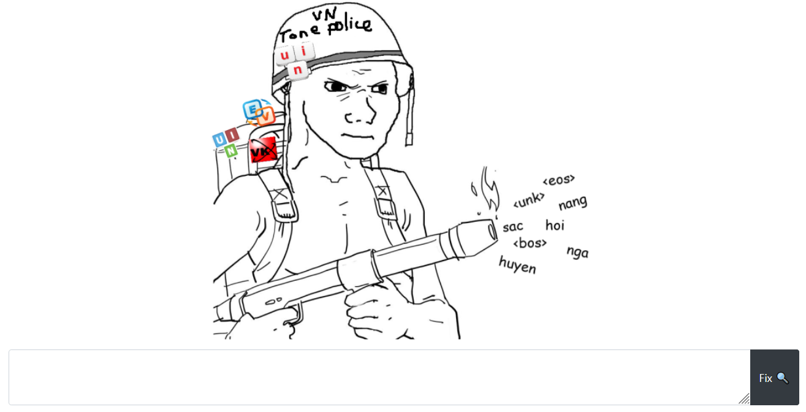
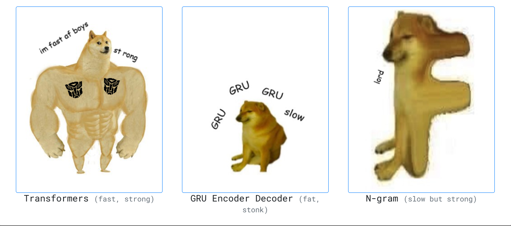
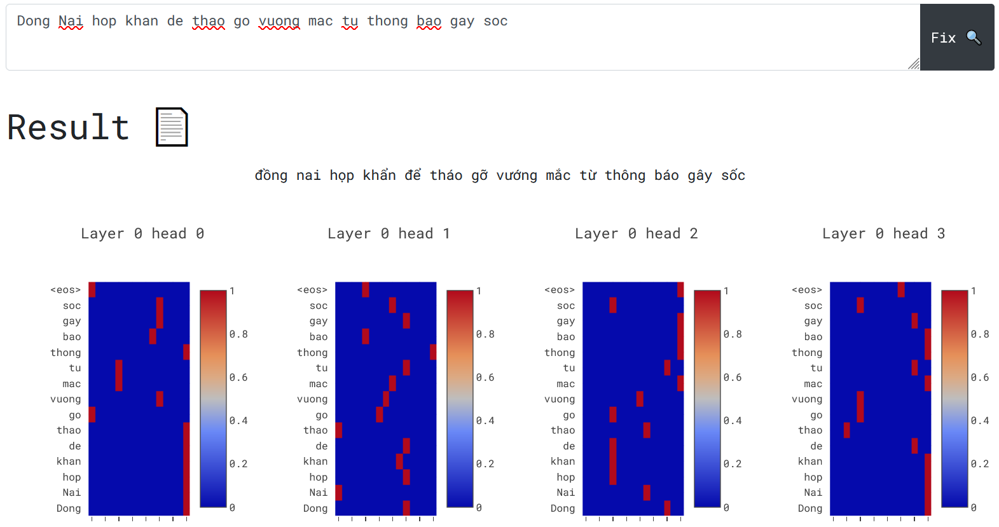

# Vietnamese tone restoration

A Natural Language Processing project for restoring Vietnamese sentence tone.


## Requirements 

```bash 
torch, torchtext, pandas, numpy, tqdm, matplotlib, flask (in newest version)
```
    
## Dataset

**Dataset 1**: includes 100K training sentence, 1K testing sentence from [this repo](https://github.com/binhvq/news-corpus#full-txttitle--description--body-v1). These are title from news article. We choosed this dataset because they are short enough.

**Dataset 2**: includes 200K training sentence, 500 testing sentence from our supervisor.

## Models

1. Transformers

| Model  | Hidden size | Num heads | Num layers | Learning rate | Epochs |
| ------------- | ------------- | ------------- | ------------- | ------------- | ------------- |
| Transformers (SMALL)  | 128  | 4 | 2 | 0.001 | 20
| Transformers (BASE)  | 512  | 8 | 6 | 0.0001 | 30

2. GRU Encoder Decoder

| Model  | Hidden size | Layers | Bidirections | Learning rate | Epochs |
| ------------- | ------------- | ------------- | ------------- | ------------- | ------------- |
| GRU Encoder Decoder  | 128  | 1 | False | 0.001 | 20

3. N-gram (baseline from [viblo](https://viblo.asia/p/language-modeling-mo-hinh-ngon-ngu-va-bai-toan-them-dau-cau-trong-tieng-viet-1VgZveV2KAw))

+ KneserNeyInterpolated

4. Beam search
 + Beam seach size: 4

All deep learning model are really sensitive to learning rate (in general we found out the bigger the model, the smaller the learning rate should be)

## Results

*Accuracy: Mean accuracy of all sentence*

| Model  | Accuracy on Dataset 1 | Accuracy on Dataset 2 |
| ------------- | ------------- | ------------- |
| Transformers (SMALL)  | **0.742**  | 0.651 |
| GRU encoder decoder  | 0.712  | 0.661 |
| N-gram  | 0.722  | **0.813** |

We also train Transformers (BASE) model on 2M sentence from Dataset 1 and perform one shot prediction on Dataset 2

| Model  | Accuracy on Dataset 1 | Accuracy on Dataset 2 |
| ------------- | ------------- | ------------- |
| Transformers (BASE) | **0.937** | **0.818** (One shot) |

## Web UI

We use Flask to build a web page for interactive experience. It can show the attention from deep learning model and the score of each result in n-gram solution. 
We can run it by:
```bash 
export FLASK_APP=inference.py
flask run
```
Then open `index.html`

<figure>
  
  <figcaption style="text-align: center;">A picture of a soldier trying to kill tone remover criminal</figcaption>
</figure>

<figure>
  
  <figcaption style="text-align: center;">Three weapon you can use in this war </figcaption>
</figure>

<figure>
  
  <figcaption style="text-align: center;">Result </figcaption>
</figure>

## Authors

- [@HKAB](https://www.github.com/HKAB)
- [@tacbliw](https://github.com/tacbliw)
- [@xuantruong2000](https://github.com/xuantruong2000)
- [@ultoxtung](https://github.com/ultoxtung)

## References

- [d2l.ai](https://d2l.ai/) (most codes are borrowed from here)
- [Veritable Tech Blog](https://blog.ceshine.net/post/implementing-beam-search-part-1/) (beam search idea)
- [Language Translation with TorchText](https://pytorch.org/tutorials/beginner/torchtext_translation_tutorial.html)
